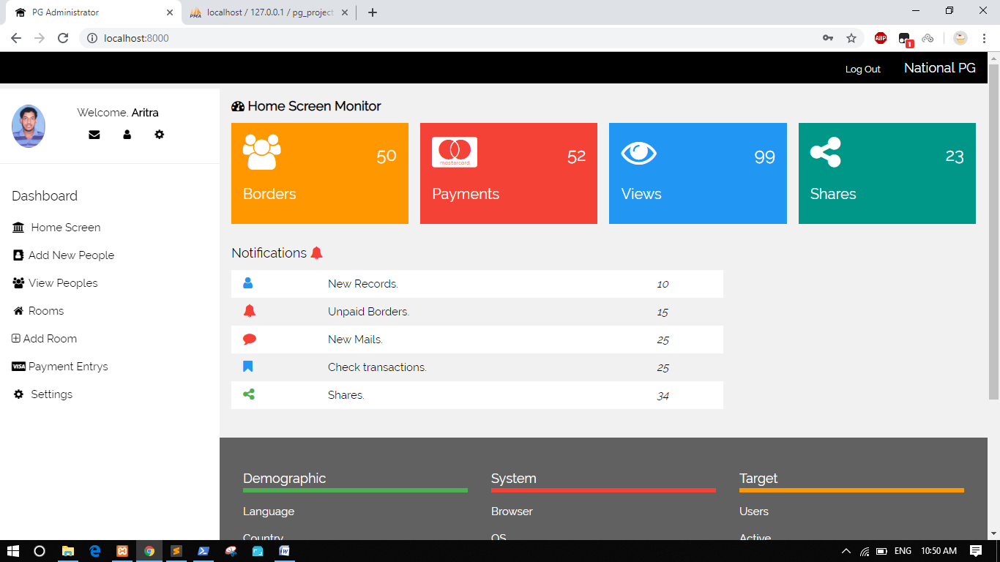

# Paying Guest Project:  🤹‍

Python Django Project on Paying Guest Management System

## Features 👀

- Add, edit, and delete peoples, Rooms, Beds
- Admin and user Login
- Secure password reset through e-mail
- Payment entry
- Receipt-copy generator
- File import export

## Built with 🏗

- [Python](https://www.python.org/)
- [Django](https://www.djangoproject.com/)
- [Bootstrap](https://getbootstrap.com/docs/4.5/getting-started/introduction/)

## Setup 🚀
### Clone: 
  $ git clone https://github.com/GitHubAri/pg_project.git 
### Setup Database:
  Open XAMPP, and start Apache Serve  
  Import DATABASE .db file
### Run:
  $ cd pg_project  
  $ python manage.py runserver
  
### Use your user-name, and password.....
File: pg_project/pg_project/settings.py     [Link](pg_project/settings.py)
- EMAIL_HOST_USER = 'YOUR_GMAIL_USERNAME'
- EMAIL_HOST_PASSWORD = 'YOUR_GMAIL_PASSWORD'
